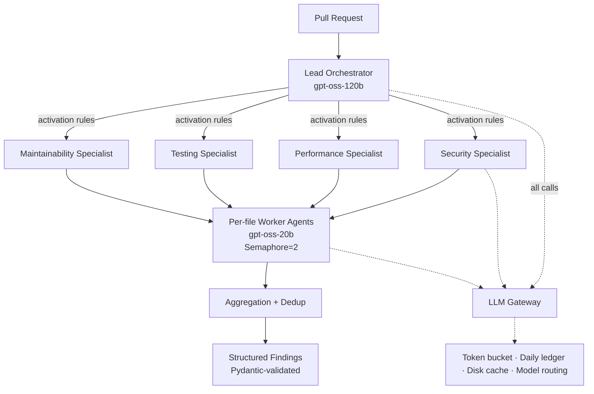

# Autonomous Code Review Swarm

A hierarchical multi-agent system that reviews GitHub pull requests and reports findings with file and line references — built to run inside a hard free-tier API budget of **30 requests/min and 8,000 tokens/min**.

Six agent roles across three tiers, wired through LangGraph, fed by an AST-aware retrieval layer, with every model call routed through a single rate-limited, cached, budget-enforcing gateway. Includes an evaluation harness that scores the swarm against real human review comments and against a single-agent baseline.

<!-- TODO: record a ~40s GIF of a review run (agent graph expanding, SSE event stream, token budget bar draining) and embed it here. This is the single highest-value addition to this README. -->
<!--  -->

<!-- TODO: deploy frontend to Vercel in replay mode and link it here -->
<!-- **[Live demo (replay mode)](#)** · -->
**[Testbed repo with planted vulnerabilities](https://github.com/Kushagra-Mishra1008/review-swarm-testbed)**

---

## Results

Measured on a 10-file pull request, all calls inside the free-tier quota:

| Metric | Value |
|---|---|
| Wall clock | 39.8s |
| Tokens consumed | 9,897 |
| Findings returned | 9 |
| Rate-limit failures (429s) | 0 |

Evaluated against **19 merged scikit-learn pull requests** with human review comments. A finding counts as a match if it lands in the same file, within ±3 lines, and is semantically similar to the human comment.

| | Swarm | Single-agent baseline |
|---|---|---|
| Precision | **17.1%** | 9.8% |
| Recall | 2.2% | **6.3%** |
| Tokens per review | 3,168 | **1,196** |

**Reading these honestly:** the swarm is meaningfully more precise — when it flags something, it is roughly twice as likely to match a real human comment. It is also worse on recall and about 2.6× more expensive per review. The hierarchical design buys signal quality, not coverage, and it buys it with tokens.

Recall is low for both systems, and that number deserves a caveat rather than a spin: human reviewers comment on intent, API design, and project convention, much of which is not recoverable from a diff alone. The baseline's higher recall comes largely from casting a wider, noisier net. I report these numbers as measured rather than picking the framing that flatters the architecture.

---

## Architecture



**Three tiers, six roles:** a lead orchestrator triages the diff and decides which specialists are warranted; four domain specialists (security, performance, testing, maintainability) each define a focus; per-file worker agents do the actual line-level scanning and fan out concurrently.

7 LangGraph nodes, 7 edges. Specialist selection happens inside the node body rather than through conditional edges, which keeps the graph flat and the routing logic inspectable in plain Python.

7 Pydantic models define every structured output. No model response is trusted without validation.

---

## The hard part: staying inside the budget

This is the constraint the whole design bends around, and it's the part I'd point to first.

A hierarchical fan-out naturally wants maximum concurrency — orchestrator, then four specialists, then one worker per changed file. On a free tier capped at 30 requests and 8,000 tokens per minute, naive parallelism trips the limit immediately and naive serialization turns a review into a multi-minute wait. Both obvious approaches fail.

Every model call in the system goes through `core/gateway.py`. Nothing bypasses it. The gateway enforces:

**Sliding 60-second token bucket** tracking requests *and* tokens independently. Exceeding either one fails a run, so both are first-class.

**Pre-LLM activation rules** — three deterministic checks that skip specialists a diff doesn't warrant. A documentation-only change never wakes the security specialist. The cheapest call is the one never made, and this is plain Python, not a model decision.

**Bounded concurrency** via `asyncio.Semaphore(2)`, capping in-flight calls so worker fan-out stays inside the window.

**SHA-256-keyed disk cache** on prompt content, so re-runs over unchanged files cost nothing.

**Two-tier model routing** across 4 task types — `gpt-oss-120b` for orchestration and specialist reasoning, `gpt-oss-20b` for per-file scanning and formatting. Mechanical work does not need the expensive model.

**Persisted daily ledger** with a 90% soft cap on the daily token allowance, surviving process restarts so the budget is not re-spent after a crash.

Retries are capped at 3 with a flat 2.0s delay between attempts. (Not exponential backoff — the variable naming in the code suggests otherwise and is misleading; fixing it is on the list below.)

---

## Retrieval layer

Findings need surrounding context, and shipping whole files into prompts is not affordable under an 8K TPM ceiling.

- **tree-sitter AST-boundary chunking** on function and class nodes, no overlap — chunks land on real code boundaries instead of arbitrary character windows (Python only at present)
- **ChromaDB** single `code_chunks` collection, embedded with `all-MiniLM-L6-v2` on local CPU — zero API cost for indexing
- **Hybrid retrieval** fusing vector similarity with exact-match ripgrep search via reciprocal rank fusion (K=60)
- **Incremental reindexing** keyed on file content hashes against a manifest, so only changed files are reprocessed and stale records are evicted

Indexed 5,654 chunks from a production open-source codebase.

---

## MCP layer

Three tools exposed over a **custom Model Context Protocol server** wrapping the retrieval layer:

- `search_code` — semantic + exact hybrid search
- `find_callers` — call-site lookup
- `get_definition` — symbol definition lookup

Consumed alongside the **official GitHub and Filesystem MCP servers**. All GitHub access was migrated to MCP — zero direct REST calls remain in the codebase.

Trade-off worth naming: the same 10-file PR takes 39.8s through direct calls and 105.9s through the MCP path, almost entirely Docker container startup overhead for the official servers. MCP bought protocol-level interoperability at a real latency cost.

---

## Frontend

FastAPI backend serving 7 REST and server-sent-event endpoints, with a React (Vite) three-column interface:

- **Agent graph** — expandable cards per agent showing role, focus list, this-run activation decision, and live per-file worker list with count badges
- **Event stream** — SSE feed of orchestration events as they happen
- **Findings panel** — structured results with file and line references
- **Live token budget bar** — the signature element; the remaining minute-window budget draining in real time as the swarm runs

Replay mode (`?replay=<run_id>`) re-streams a recorded run, so the system can be demonstrated without spending quota.

---

## Repo layout

```
core/         config, models, budget (TokenBucket + DailyLedger), cache, gateway
agents/       state, lead orchestrator, 4 specialists, worker, LangGraph wiring
retrieval/    tree-sitter chunker, Chroma indexer, hybrid search
tools/        diff parsing, MCP clients, Repo Index MCP server
eval/         harness, scoring, report generation
frontend/     React + Vite client
scripts/      development and verification scripts
```

---

## Running it

```bash
git clone https://github.com/Kushagra-Mishra1008/review_swarm
cd review_swarm
pip install -r requirements.txt
```

Set your API credentials:

```bash
export GROQ_API_KEY=...
export GITHUB_TOKEN=...
```

Index a repository, then review a pull request:

```bash
python -m retrieval.index --repo /path/to/repo
python -m agents.run --pr <owner>/<repo>#<number>
```

Run the frontend:

```bash
cd frontend && npm install && npm run dev
```

Reproduce the evaluation:

```bash
python -m eval.run --prs 19 --baseline
```

---

## Limitations

Stated plainly, because they're the honest state of the project:

- **Recall is low** (2.2%), below the single-agent baseline. The architecture optimizes precision, not coverage.
- **More expensive than the baseline** — 3,168 vs 1,196 tokens per review. The multi-agent design has to earn that premium, and on recall it currently doesn't.
- **Evaluated on 19 PRs**, short of the 30–50 target. Small sample; the precision gap is directionally clear but not tightly bounded.
- **Python only** — tree-sitter chunking is not yet wired for other languages.
- **Retry backoff is flat, not exponential**, despite variable naming that implies otherwise.
- **MCP path is ~2.7× slower** than direct calls due to container startup overhead.
- Single evaluation corpus (scikit-learn), so findings may not generalize across project conventions.

## Next

- Widen the eval corpus to 30–50 PRs across multiple repositories
- Investigate the recall gap — likely a specialist-activation tuning problem rather than a model-capability one
- Fix the retry backoff to be genuinely exponential
- Multi-language tree-sitter support
- Error tracking and metrics dashboards for run observability
